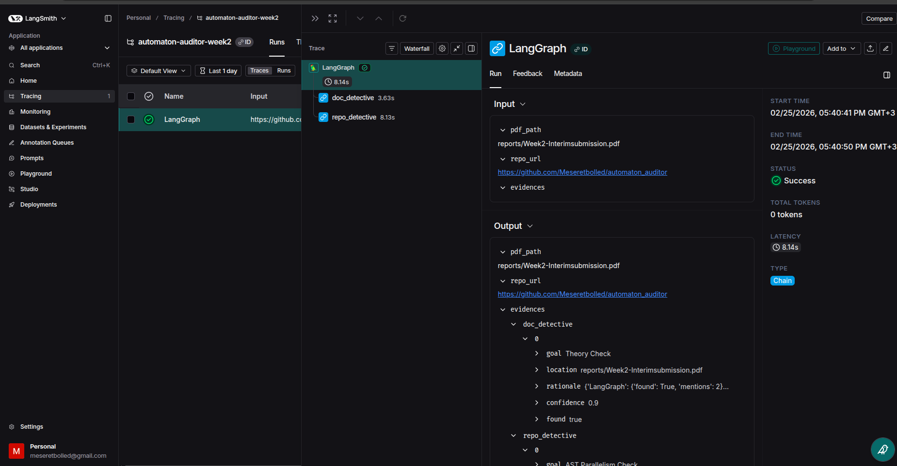

# 🕵️ The Automaton Auditor: Week 2 Forensic Swarm

## 📌 Project Overview
The **Automaton Auditor** is a multi-agent system built with **LangGraph** designed to perform deep forensic audits of autonomous agent repositories. Instead of simple text analysis, it uses Abstract Syntax Trees (AST) and sandboxed execution to verify technical compliance.

### ⚖️ The "Master Thinker" Architecture
This implementation follows a **Fan-Out/Fan-In** pattern to ensure non-linear, concurrent auditing as required by the "Robust Swarm" rubric:

1. **Forensic Layer (Parallel):**
   - **RepoInvestigator:** Performs deep AST parsing to verify `StateGraph` instantiation and parallel wiring.
   - **DocAnalyst:** Uses `Docling` to perform "RAG-lite" verification of theoretical depth in reports.
2. **State Management:** Uses a strictly typed `Pydantic` schema with `operator.ior` reducers to merge parallel evidence streams without data loss.


---

## 🛠️ Tech Stack
- **Orchestration:** LangGraph (StateGraph)
- **Environment:** `uv` (Isolated CPython 3.13.7)
- **Parsing:** `Docling` with RapidOCR(Torch backend)&Python `ast` module
- **Observability:** LangSmith (Forensic Traceability)

---

## 🚀 Getting Started

### 1. Installation
Ensure you have the `uv` package manager installed.
```bash
# Sync dependencies and create virtual environment
`uv sync`

 2. Environment Configuration
Create a .env filein the root directory:

```OPENAI_API_KEY=your_openai_key
LANGCHAIN_TRACING_V2=true
LANGCHAIN_API_KEY=your_langsmith_key
LANGCHAIN_PROJECT="automaton-auditor-week2"```

3. Running the Audit
Execute the forensic swarm against a target GitHub repository and its interim report:

# Run the main entry point
uv run python -m src.main --repo "[https://github.com/peer/repo](https://github.com/peer/repo)" --pdf "interim_report.pdf"

🛡️ Forensic Protocols
Sandbox Isolation: All repository analysis is performed tempfile.TemporaryDirectoryto prevent code injection or local environmental pollution.

AST vs. Regex: The auditor ignores comments and strings, focusing only on the logical structure of the code (eg, detecting if builder.add_edgeit is actually called).

Concurrency Proof: Every run is logged to LangSmith, providing a timestamped trace of parallel execution branches.

## 🕵️‍♂️ Technical Proof: Orchestration & Parallelism

To verify the "Master Thinker" rubric requirements for parallel execution and graph orchestration, see the LangChain LangSmith trace below:



* **Parallel Execution**: Notice how `doc_detective` and `repo_detective` execute simultaneously in the waterfall view.
* **Structured Evidence**: The output pane confirms the successful merge of OCR data and AST verification.

## 🛡️ Forensic Protocols & Multimodal Logic

Multimodal Document Analysis: The system integrates Docling paired with RapidOCR to audit non-text-searchable PDFs, ensuring diagrams or scanned text are analyzed for technical keywords like "LangGraph" and "Reducers."

Static Code Analysis (AST): Instead of unreliable regex, the RepoInvestigator uses the Python ast module to walk the code's structural tree, verifying actual StateGraph instantiation while ignoring comments and strings.

Sandbox Isolation: All repository analysis is performed within tempfile.TemporaryDirectory to prevent code injection or local environmental pollution.

Concurrency Proof: Every run is logged to LangSmith, providing a timestamped "Waterfall" trace of parallel execution branches.


Interim Submission Status
[x] Functional LangGraph with parallel nodes.

[x] Pydantic state schema with data reducers ( operator.ior).

[x] Sandboxed Git cloning via GitPython.

[x] AST-based graph verification logic.\n## 📊 Swarm Status: Level 1 Detectives Active
