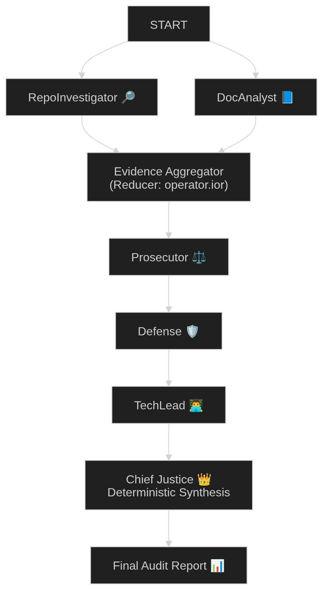
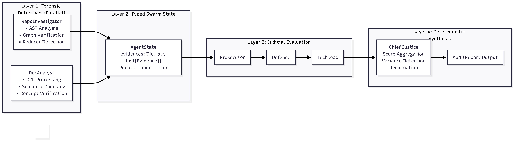
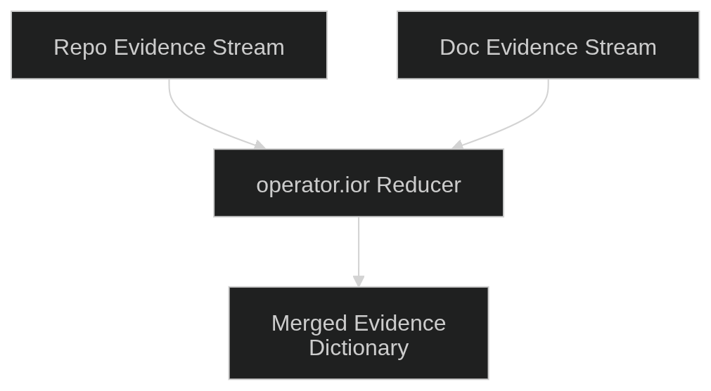

# 🕵️ Automaton Auditor  
### A Multi-Agent Forensic Swarm for Auditing Autonomous Systems

The **Automaton Auditor** is a structured multi-agent system built with **LangGraph**.  
It performs deep forensic audits of autonomous repositories by combining:

- Static code analysis (AST verification)
- Multimodal document inspection (OCR + semantic chunking)
- Structured judicial reasoning (LLM-backed debate)
- Deterministic score synthesis

The system follows a **Fan-Out / Fan-In Swarm Architecture** with typed state reducers to ensure safe parallel execution.

---

# 📌 Project Overview

Unlike simple text analysis tools, Automaton Auditor verifies:

- Actual `StateGraph` instantiation
- Reducer usage for safe concurrency
- Parallel fan-out / fan-in wiring
- Theoretical alignment between repository and documentation
- Structured AI reasoning vs factual verification

The system is designed to meet the **Robust Swarm Architecture Rubric** requirements.

---

# 🏗 System Architecture

## 🔁 High-Level Execution Flow



Execution Model:

1. Detectives run in parallel  
2. Evidence streams merge via typed reducer  
3. Three judicial personas evaluate independently  
4. Chief Justice synthesizes scores deterministically  
5. Final structured audit report is generated  

---

## 🧠 Layered Architecture View



### Layer 1 — Forensic Detectives (Parallel)
- **RepoInvestigator**
  - Python AST analysis
  - Graph structure verification
  - Reducer detection
- **DocAnalyst**
  - RapidOCR processing
  - Semantic chunking
  - Concept verification

### Layer 2 — Typed Swarm State
- `AgentState`
- Evidence dictionary
- `operator.ior` reducer for safe merging

### Layer 3 — Judicial Evaluation
- Prosecutor (strict)
- Defense (balanced)
- TechLead (engineering-focused)

### Layer 4 — Deterministic Synthesis
- Chief Justice score aggregation
- Variance detection
- Remediation suggestions
- Final structured JSON report

---

## 🔄 Evidence Reducer Mechanism



Parallel evidence is merged using `operator.ior` to prevent:

- State overwrite
- Evidence loss
- Concurrency race conditions

This guarantees deterministic fan-in behavior.

---

# ⚖ Judicial Layer

Each criterion is evaluated by three distinct personas:

| Judge | Role |
|-------|------|
| Prosecutor | Strict, skeptical, penalizes gaps |
| Defense | Fair, credits partial implementation |
| TechLead | Engineering-focused, values architecture |

All judges return structured outputs validated by Pydantic.

The Chief Justice:
- Computes average score
- Detects variance (disagreement)
- Generates remediation guidance

---

# 🛠 Tech Stack

| Layer | Technology |
|-------|------------|
| Orchestration | LangGraph (StateGraph) |
| LLM | Groq (Llama 3.1-8b-instant) |
| Static Analysis | Python `ast` module |
| OCR | RapidOCR |
| State Modeling | Pydantic |
| Environment | uv (Python 3.13 isolated env) |
| Observability | LangSmith |

---

# 🚀 Getting Started

## 1️⃣ Install Dependencies

```bash
uv sync
 ```
Activate environment:

```source .venv/bin/activate```

2️⃣ Configure Environment

Create a ```.env``` file in the project root:

```GROQ_API_KEY=your_groq_key```
```GROQ_MODEL=llama-3.1-8b-instant```
```LANGCHAIN_TRACING_V2=true```
```LANGCHAIN_API_KEY=your_langsmith_key```
```LANGCHAIN_PROJECT=automaton-auditor-week2```

---

3️⃣ Run the Auditor

```python -m src.main```

---

## The system will:

- Clone & sandbox target repository

- Process PDF report

- Run parallel detectives

- Execute judicial reasoning

- Output structured final audit JSON
  
---

## 🛡 Forensic Protocols

- Sandboxed Repository Analysis

- All repository inspection runs inside temporary directories to prevent:

- Code injection

- Local environment pollution

- Unsafe execution

- AST-Based Verification

** The RepoInvestigator:**

- Ignores comments and strings

- Inspects real code structure

- Detects actual graph wiring

- Multimodal PDF Inspection

## DocAnalyst:

Extracts text via RapidOCR

Performs semantic chunk search

Verifies theoretical claims

Structured LLM Outputs

## Judges:

Return strict JSON

Are validated via Pydantic

Fall back safely if parsing fails

## 📊 Example Output

```json
{
  "overall_score": 3,
  "criteria": [
    {
      "criterion_id": "graph_architecture",
      "final_score": 3,
      "summary": "Chief Justice synthesis.",
      "remediation": [
        "Tighten reducer verification evidence."
      ]
    }
  ]
}`

```
## 📈 Current Swarm Status

 - Parallel LangGraph execution

- Typed AgentState with reducers

- AST-based graph verification

- Multimodal PDF chunk inspection

- Structured judicial layer

 Deterministic score synthesis


## 🧠 Design Philosophy

- The Automaton Auditor separates:

- Fact verification (AST, OCR)

- Reasoning (LLM judges)

- Deterministic scoring (Chief Justice)

  This prevents hallucination from contaminating structural validation.


## 📜 License

MIT License


## 👩‍💻 Author - ** Meseret Bolled**
- Software Engineering Student
- Focused on AI-native system architecture & multi-agent design